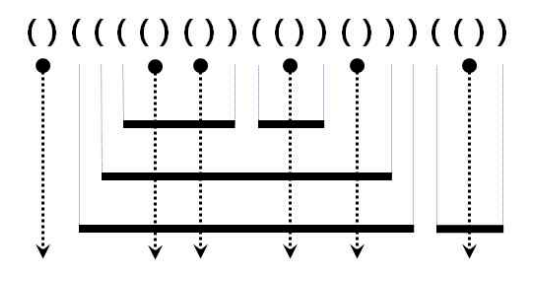

```cpp
#include <bits/stdc++.h>
using namespace std;

int main(void) {
    int layer=0, count=0;
    string s;
    cin >> s;

    for(int i=0; i<s.length(); i++) {
        if(s[i] == '(') {
            layer++;
        } else if(s[i] == ')' && s[i-1] == '(') {
            layer--;
            count += layer;
        } else {
            count++;;
            layer--;
        }
    }

    cout << count;

}
```

## 풀이



그림을 통해 살펴보면 레이저 이전에 겹쳐진 쇠파이프의 수만큼 레이저로 잘라지면 전체 쇠파이프의 수가 추가된다.

( 가 입력되면 쇠파이프가 겹쳐진다고 생각하고 layer에 1씩 더한다. 다만 바로 다음에 )가 입력이 되면 그건 파이프가 아니라 레이저이기 때문에 layer에 1을 뺀 후 전체 파이프를 구하는 count변수에 추가한다. 레이저가 아닌 )의 경우 파이프가 끝나는 것을 의미하기 때문에 전체에 1을 추가하고 겹쳐진 파이프의 수를 1 줄인다.
