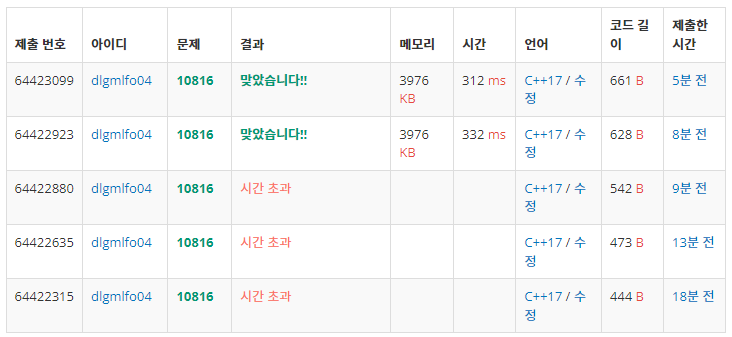

```cpp
#include <iostream>
#include <vector>
#include <algorithm>
using namespace std;

int main() {
    ios_base :: sync_with_stdio(false); 
    cin.tie(NULL); 
    cout.tie(NULL);
    
    int N, M;
    cin >> N;

    vector<int> v(N);

    for(int i=0; i<N; i++) {
        cin >> v[i];
    }
    
    sort(v.begin(), v.end());

    cin >> M;
    int tmp, cnt;
    for(int i=0; i<M; i++) {
        cin >> tmp;
        cnt = upper_bound(v.begin(), v.end(), tmp) - lower_bound(v.begin(), v.end(), tmp);
        
        cout << cnt << " ";
        //cout << upper_bound(v.begin(), v.end(), tmp) - lower_bound(v.begin(), v.end(), tmp) << " ";
    }
    
    return 0;
}
```

## 시도 현황



## 원인

```cpp
ios_base :: sync_with_stdio(false); 
cin.tie(NULL); 
cout.tie(NULL);
```

위 코드 유무에 따라 실행 시간이 바뀐다.

자세한 이유는 아래 링크에서 확인

https://jaimemin.tistory.com/1521
